# Crime Vault ER Diagram

This diagram is based on the database migrations and Eloquent relationships in the project.

```mermaid
erDiagram
    USERS {
        bigint id PK
        varchar name
        varchar email UK
        timestamp email_verified_at "nullable"
        varchar password
        varchar role
        varchar remember_token "nullable"
        timestamp created_at
        timestamp updated_at
    }

    SERIAL_KILLERS {
        bigint id PK
        varchar name "nullable"
        varchar nickname
        json ages
        varchar country
        json victim_count
        longtext description
        varchar image "nullable"
        timestamp created_at
        timestamp updated_at
    }

    VICTIMS {
        bigint id PK
        bigint killer_id FK
        json count
        timestamp created_at
        timestamp updated_at
    }

    UNSOLVED_CASES {
        bigint id PK
        varchar name
        varchar country
        json count
        json suspects
        longtext description
        varchar image
        timestamp created_at
        timestamp updated_at
    }

    RESOURCES {
        bigint id PK
        enum resource_type
        varchar title
        longtext url
        varchar description
        timestamp created_at
        timestamp updated_at
    }

    FAVOURITES {
        bigint id PK
        bigint user_id FK
        bigint favouritable_id
        varchar favouritable_type
        timestamp created_at
        timestamp updated_at
    }

    DISCUSSIONS {
        bigint id PK
        bigint user_id FK
        bigint discussable_id
        varchar discussable_type
        text content
        timestamp created_at
        timestamp updated_at
    }

    CASE_EVENTS {
        bigint id PK
        bigint eventable_id
        varchar eventable_type
        varchar title
        varchar event_type
        date event_date
        varchar location "nullable"
        decimal latitude "nullable"
        decimal longitude "nullable"
        text description "nullable"
        timestamp created_at
        timestamp updated_at
    }

    PASSWORD_RESET_TOKENS {
        varchar email PK
        varchar token
        timestamp created_at "nullable"
    }

    SESSIONS {
        varchar id PK
        bigint user_id "nullable, indexed"
        varchar ip_address "nullable"
        text user_agent "nullable"
        longtext payload
        integer last_activity "indexed"
    }

    CACHE {
        varchar key PK
        mediumtext value
        bigint expiration "indexed"
    }

    CACHE_LOCKS {
        varchar key PK
        varchar owner
        bigint expiration "indexed"
    }

    JOBS {
        bigint id PK
        varchar queue "indexed"
        longtext payload
        smallint attempts
        integer reserved_at "nullable"
        integer available_at
        integer created_at
    }

    JOB_BATCHES {
        varchar id PK
        varchar name
        integer total_jobs
        integer pending_jobs
        integer failed_jobs
        longtext failed_job_ids
        mediumtext options "nullable"
        integer cancelled_at "nullable"
        integer created_at
        integer finished_at "nullable"
    }

    FAILED_JOBS {
        bigint id PK
        varchar uuid UK
        varchar connection
        varchar queue
        longtext payload
        longtext exception
        timestamp failed_at
    }

    USERS ||--o{ FAVOURITES : creates
    USERS ||--o{ DISCUSSIONS : writes
    USERS ||--o{ SESSIONS : "has sessions"

    SERIAL_KILLERS ||--o| VICTIMS : "has one victim record"
    SERIAL_KILLERS ||--o{ FAVOURITES : favouritable
    UNSOLVED_CASES ||--o{ FAVOURITES : favouritable
    SERIAL_KILLERS ||--o{ DISCUSSIONS : discussable
    UNSOLVED_CASES ||--o{ DISCUSSIONS : discussable
    SERIAL_KILLERS ||--o{ CASE_EVENTS : eventable
    UNSOLVED_CASES ||--o{ CASE_EVENTS : eventable
```

## Relationship notes

- `serial_killers.killer_id` is a concrete foreign key to `serial_killers.id`. Eloquent exposes it as `SerialKiller::victimRecord()` and `Victim::killer()`.
- `favourites`, `discussions`, and `case_events` use Laravel polymorphic relations. Their `*_id` and `*_type` columns are paired values, not database-enforced foreign keys.
- The current models expose `SerialKiller` and `UnsolvedCase` as targets for all three polymorphic relations. `Resource` and `Victim` are standalone apart from the killer relationship shown above.
- `sessions.user_id` is indexed and nullable in the Laravel migration, but it is not declared as a database foreign key. The diagram shows the application-level association as a dashed-style conceptual relationship label.
- `password_reset_tokens`, `cache`, `cache_locks`, `jobs`, `job_batches`, and `failed_jobs` are Laravel infrastructure tables and do not have relationships to the Crime Vault domain tables.