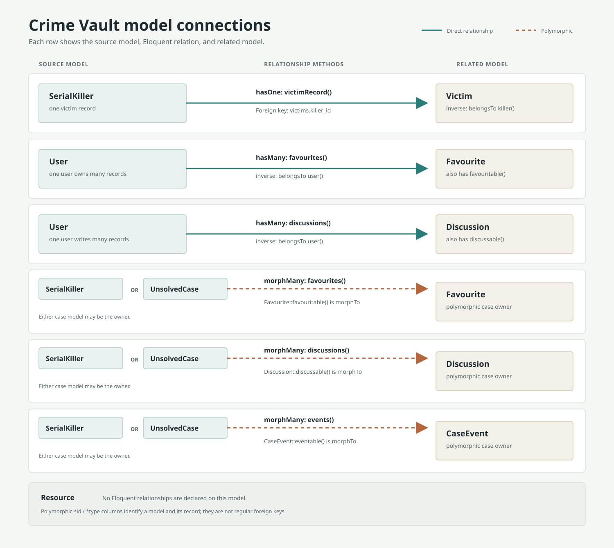
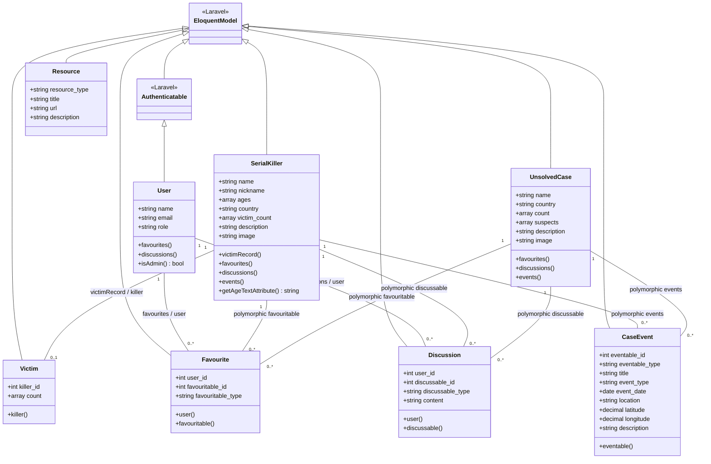

# Crime Vault Model Class Diagram

This UML class diagram documents the application's Eloquent model layer. Controllers and views are not shown because this diagram is based on the models and their declared relationships.

The SVG is available on its own at [model-connections.svg](model-connections.svg).

## Relationship details

- `SerialKiller::victimRecord()` is a `hasOne` relationship and `Victim::killer()` is its inverse `belongsTo`. The foreign key is `victims.killer_id`. The migration does not make this column unique, so the one-to-one shape is enforced by the Eloquent relationship convention rather than by a database uniqueness constraint.
- `Favourite` and `Discussion` each belong to a `User`; the user has many of each.
- `Favourite::favouritable()`, `Discussion::discussable()`, and `CaseEvent::eventable()` are polymorphic `morphTo` relationships. Their corresponding model `morphMany` relationships are declared on `SerialKiller` and `UnsolvedCase`. The polymorphic type/id pairs identify the owner and are not ordinary foreign keys to either target table.
- `Resource` has no Eloquent relationships declared in its model.
- `User` extends Laravel's `Authenticatable`, which itself extends Laravel's Eloquent `Model`. The other application models extend Eloquent `Model` directly.